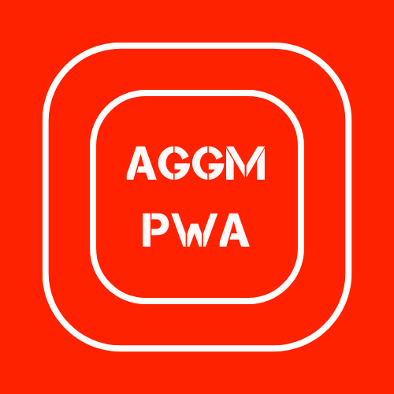
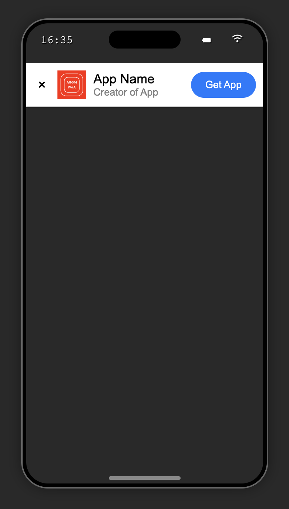
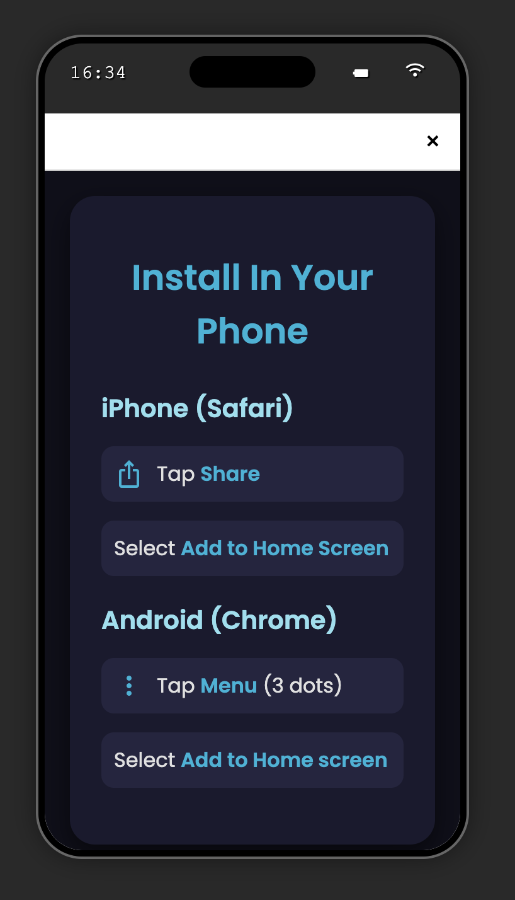

# AGGM-PWA
A template for building Progressive Web Apps.

<div display="flex" flex-direction="column">
  
  
</div>

Aggm PWA has the following files:

- ``` phone.html ``` : This shows the index.html
- ``` installer.html ``` : Installer shows a view that explains to the user how to instal the PWA.
- ``` notifications.js ``` : This allows you to send notifications to the user.
- ``` service-worker.js ``` : This allows the PWA to work offline.
- ``` manifest.json ``` : This configures some parts of the PWA.
